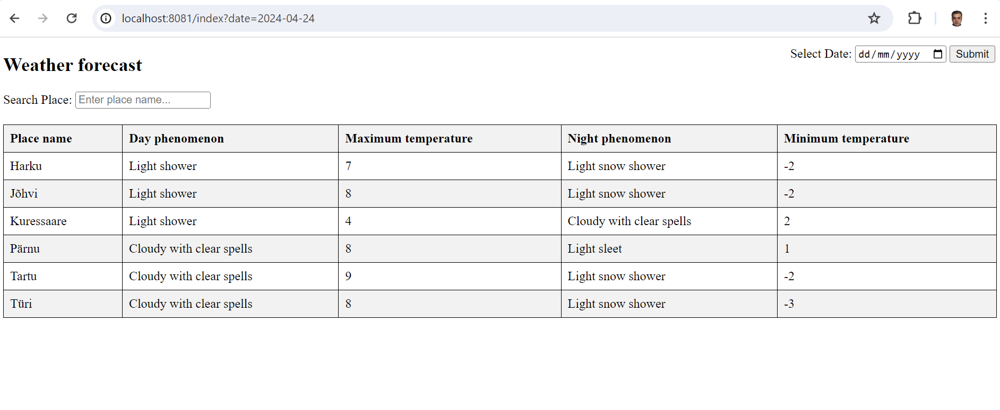

# Weather Forecast Application

Java21, Spring Boot 3.2

## Description

This application consists of 3 modules:
1. Common - Entity class and repository for that model
2. Importer - Module for reading, parsing and storing data. As it is mentioned in task description, I assume that you have postgres database with the name 'weather'. For different credentials, please check properties file.
3. Web - Web Page for showing data which was collected by Importer
## Installation

For running Importer, change directory

```bash
  cd importer
```
Start Spring Boot application
```bash
  ./gradlew bootRun 
```
For running web, go to web directory
```bash
  cd web
```
and run app
```bash
  ./gradlew bootRun 
```

App will be available at:
```bash
http://localhost:8081/index
```
Our view:


## General thoughts:
I decided to move core things to common module, since it is being used by another modules as well. In Importer module I used JAXB library for getting and parsing xml objects.
In the Web module, I opted for the MVC + Thymeleaf approach due to requirement to add a Gradle module. Integrating modern frameworks like React.js or Vue.js would have required additional investigation to create Gradle tasks, and managing these technologies often involves different tools and workflows, which would have extended the development timeline.